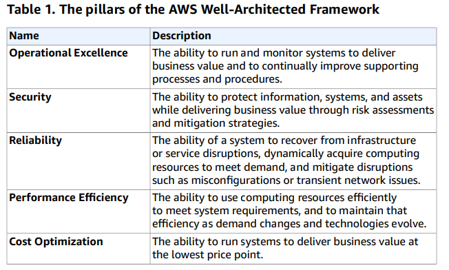

# Exam Guide

## What to Expect: Breakdown of Topics
* Resilient Architectures
    * 34% of Exam
        * Choose reliable/resilient storage
        * Decoupling mechanisms
        * Multi-tiered
* Performant Architectures
    * 24% of Exam
        * Choose performant storage
        * Caching to improve performance
        * Design solutions for elasticity & scalability
* Secure Applications
    * 26% of Exam
        * Securing application tiers
        * Securing data
        * Networking infrastructure for a single VPC application
* Cost-Optimized Architectures
    * 10% of Exam
    * _HINT_: Trusted Advisor is a pretty heavily relied upon resource in the exam
        * Cost-optimized storage
        * Cost-optimized compute
* Operational Architectures
    * 6% of Exam
        * Design features in solutions

## Validate Expertise with AWS Certification
* Architecture
    * Associate: Solutions Architect
    * Professional: Solutions Architect
* Developing
    * Associate: Developer
    * Professional: DevOps Engineer
* Operations
    * Associate: SysOps Administrator
    * Professional: DevOps Engineer
* Specialty
    * Big Data
    * Machine Learning
    * Advanced Networking

