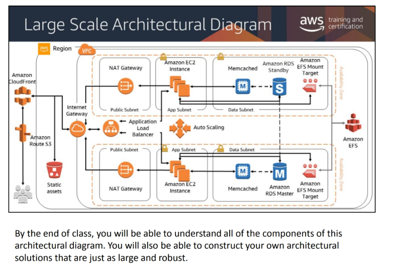

# Large Scale Architectural Diagram

### S3 Buckets:
* 5 TB upload limit per object.

### VPC:
* Scoped to regions
* Contains multiple subnets
* Subnets scoped to the Availability Zone
 
### Elisticache:
* Elisticache can deploy __Memcached__ (this is the most appropriate Relational Databases) and 
* Elisticache can deploy __Redis__ (this is the most appropriate for Non Relational Databases; i.e. DynamoDB)

### RDS:
* The master database is reading and writing
* The standby is just for replication

### NAT Gateways:
* They only allow outbound requests to the internet
* They only allow responses from those requests to the internet

### EFS (Elastic File Storage):
* Shares data across 
    * Side Notes:
        * EFS is linux based
        * FSX (Windows version of EFS)
        * FSX w/ Luster (Scientific Processing at PB scale)

### Security Groups (Missing from Image):
* Every service would have it's own Security Group
    * Lives internal to the server
    * Every service would have it's own NACL (Network Access Control List)

### IAM Permissions:
* Defined in a JSON Document
    * Define __Effect__: Allow or Deny
    * Define __Action__ of Resource (S3 for example): GET / PUT / LIST / DELETE  
    * Define __Resource__: What resource are you allowed to ACTION
    * (OPTIONALLY) *Condition*: What else would you like? You're only allowed SFTP or HTTPS.