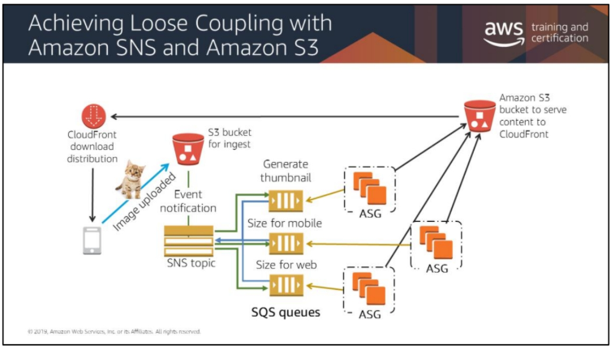

# Simple Notification Service (SNS)

## Overview
* SNS is a webservice that makes it easy to set up, operate, and send notifications from the cloud. 
    *  The service follows the “publish-subscribe” (pub-sub) messaging paradigm

## SNS
* Email
* HTTP/HTTPS
* Short Message Service (SMS) clients
* SQS queues
* Lambda function integration

## Use Cases for Simple Notification Service

