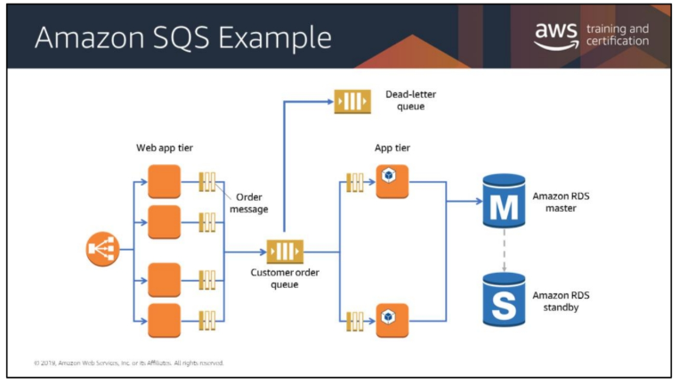
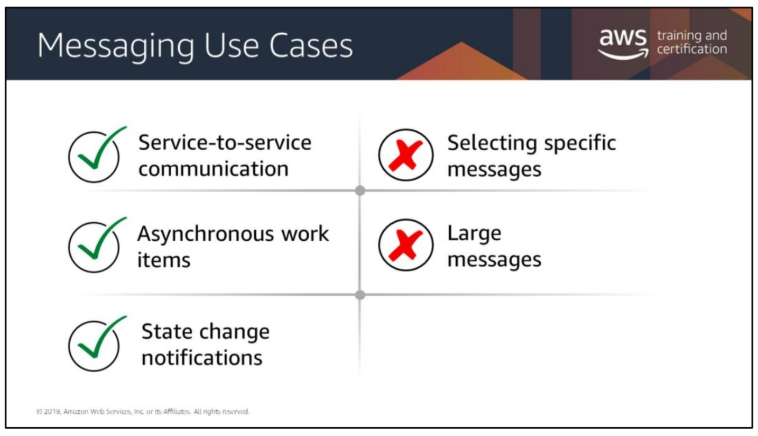

# Simple Queue Service (SQS)
* Fully managed message queieing service
    * There is a __PRODUCER__ that has your message
    * There is a __CONSUMER__ that has to subscribe to the producing service
* Messages are stored until they are processed and deleted
* Acts as a buffer between senders andreceivers

## Simple Queue Service: When would you use it?
* Asynchronous processing is needed
* Need to get your responses from each step quickly
* Performance and service requirements
* Needs to increase the number of job instances
* Needs to easily recover from failed steps since messages will remain in the queue

## Types of Queues in Simple Queue Service
* Standard Queues
    * __At least once__ delivery
    * __nearly unlimited number of transactions per second__ for each API action
    * Could send multiple messages in error

* FIFO Queues (First-In; First-Out)
    * Messages are __processed exactly once__
    * Support up to __300 messages per second__
    * Extremely reliable

## SQS Features
* If no time to live is set
    * Default is set to 14-days
        * Create a DLQ (Dead-Letter-Queue) to give visibility into failed messages
* Visibility timeouts
* _Long polling_: is a way to retrieve messages from your SQS queues

## SQS Example

## Use Cases
