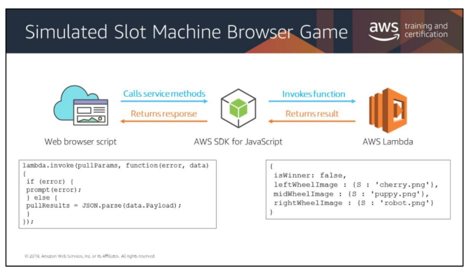
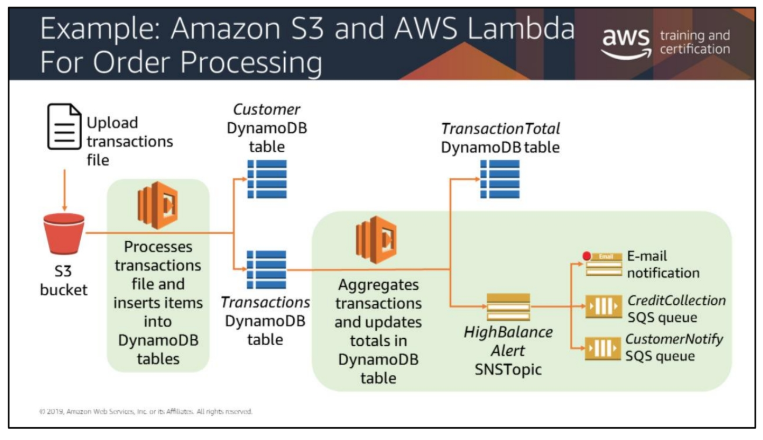
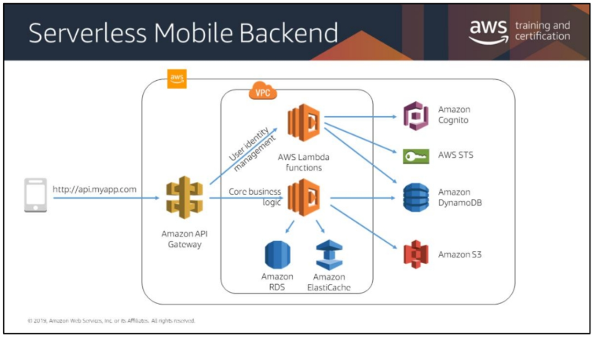

# Going Serverless

## Lambda
* Fully managed compute service
* Runs stateless code
* Supports Node, Java, Python, C#, Go, Ruby
* Runs your code on a schedule or in response to events
* Can run at the edge

### Lambda Logistics
* 128 MB of MV Ram and 1 Virtual CPU 
    * Could be given 3GB of Ram and 2 Virtual CPUs
* Time to Live: 15 minutes
* __Lambda Cost Model__:
    * Events consumed
    * CPU bandwidth used
    * AWS GIVES YOU 
        * 1,000,000 events every month
        * 400,000GB of CPU every month

### Lambda Usecases
* ##### Slot Machine
*    

* ##### Order Processing
* 

* ##### Mobile Backend
* 

## API Gateway
* Allows you to create APIs that act as "front doors" for your applications
* Handles up to hundreds of thousands of concurrent API calls
* Prevents exposing endpoints
* DDoS and injection attacks