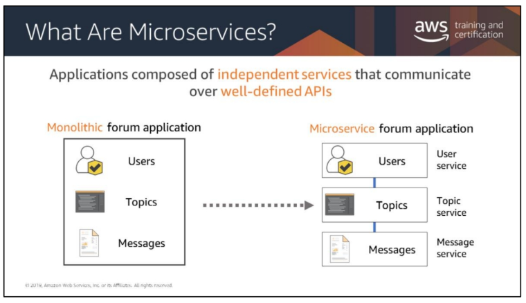

# Introduction to Microservices and Serverless Architectures

## Overview
* Your monolitic architecture is decoupled, the individual components are managed by separate teams
    * This is causing conflicts if one team changes their components

## What are Microservices?
* An application is built as independent components that run each application process as a service
* These services communicate via a well-defined interface using lightweight APIs
*  Services are built for business capabilities, and each service performs a single function.

## Characteristics of a Microservice
* Autonomous
    * Architecture can be developed, deployed, operated, and scaled without affecting the functioning of other services
* Specialized
    *  Each service is designed for a set of capabilities and focuses on solving a specific problem