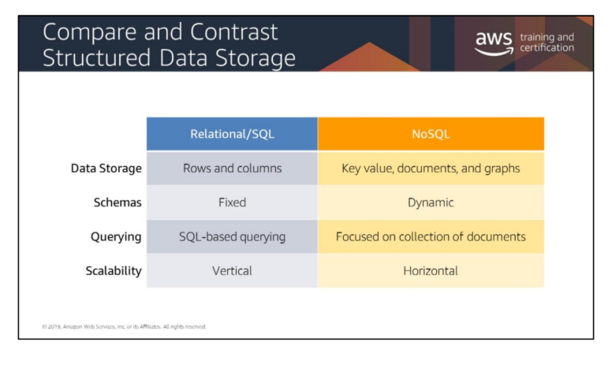
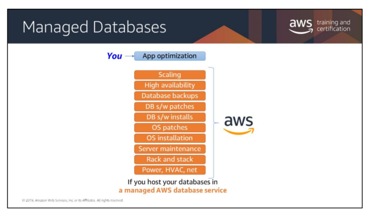

# Introduction to the DB Layer

## Important Notes:
* #### OLTP - Online Transaction Platform
    * Think of using RDS
* #### OLAP - Online Analytics Platform
    * Think of using Redshift
* #### Have Transaction-based Requirements? 
    * Use RDS and DynamoDB
* #### Managed Databases? 
    * Think of using Aurora Serverless (Relational) and DynamoDB (NoSQL)

## Relational Database Services (RDS)
* Options for Databases in RDS:
1. Oracle
2. Microsoft SQL
3. MySQL
4. MariaDB
5. PostGres
6. Aurora 
7. Aurora Serverless

## What should you consider?
* Scalability
    * How much throughput do we need?
    * Will the solution we choose be able to scale up later if needed?
* Total storage requirements
    * How large does our database need to be?
    * Will we have GB, TB, or PB of data?
* Object size and type
    * Do we need to store simple data structures
* Durability
    * What level of data durability, data availability, and recoverability do you require?
    * Do you have a related regulatory obligation?

## ACID Compliance
* A: Atomic
    * If one part fails, the whole transaction fails.
    * "All or Nothing"
* C: Consistency
    * Data will be consistent according to defined rules
* I: Isolation
    * Multiple Writes don't cause Merge conflicts
* D: Durability
    * Transactions can be recovered easily

## When to choose a relational database:
* ACID Compliance is necessary
* Strict schema rules & data quality enforcement
* Database doesn't need extreme read/write capacity
* If you have a relational dataset that does not require extreme performance

## When to choose a non-relational database:
* You need your database to scale horizontally
* Your data does not lend itself well to traditional schemas
* Your read/write rates exceed those that can be economically supported through traditional SQL DB

## Managed Databases
* Options:
    * Aurora Serverless
    * DynamoDB
* Services that you are in charge of: 
    * App optimization

