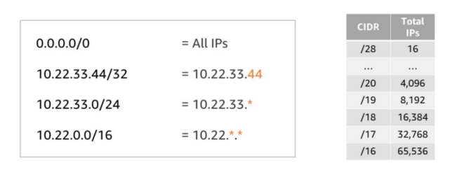

# Routing

## VPC and IP Addressing
* Each VPC reserves a range of private IP addresses that you specify
* Those private IP addresses can be used by resources deployed into that VPC
* The IP range is defined using Classless Inter-Domain Routing (CIDR) notation
* Supports bringing your own IP prefixes
* _EXAMPLE_: 10.0.0.0/16 ==> all IPs from 10.0.0.0 to 10.0.255.255 
    * /16 is CIDR notation for 16 binary bits (written in decimal for some reason)
        * 16 (Decimal) is Bx010000
* __The largest range is a /16__
* __The smallest range is /28__
* You are allowed your own route tables in your VPCs

## Using Subnets to Divide your VPC
* A subnet with 10.0.0.0/22 will create how many IP addresses
    * A VPC with CIDR /22 includes __1,024__ total IPs
        * After dividing your VPC into Subnets, your subnets will have individual CIDR notated IP addresses.

## Route Tables
* Required to direct traffic between VPC resources
* Each VPC has a main route table by DEFAULT 
    * __10.0.0.0/16 => local__
* You can create custom route tables
* All subnets must have have an associated route table
* __Best practice: Use custom route tables for each subnet__

## Connecting Private Subnets to the Internet
* ### Internet Gateways
    * Allow communication between instances in your VPC and the internet
    * Are horizontally scaled, redundant, and highly available by default
    * Provide a target in your subnet route tables for internet-routable trafficc
* ### NAT Gateways
    * Enable instances in the private subnet to initiate outbound traffic to the internet or other AWS services
    * Prevent private instances from receiving inbound traffic from the internet
    * __OUTBOUND REQUESTS ONLY__
    * Limitations: You can not do URL filtering
        * You will need a __NAT Instance__ to do this

## Subnet Use Case Examples
* Data store instances
* Batch processing instances
* Back-end instances
* Web application instances

## Definitions - How do you know which is which?
* Elastic Network Interface
    * Low, Medium, High
        * Use this when you need to 
            * Create a management network
            * Use network and security appliances in your VPC
            * Create dual-homed instances with workloads/roles on distinct subnets
* Elastic Network Adaptor 
    * 10, 20, 25  
* Elastic Fabric Adaptor
    * 50, 75, 100

## 2 ways to assign IP addresses
* Dynamically assigned 
    * Changes when stopped and started again
* Statically assigned (Elastic IPs)
    * Costs money.
        * 1st is free __WHEN ATTACHED__
    * Can be associate with an instance or a network interface
    * 5 allowed per AWS Region (Soft Limit)

