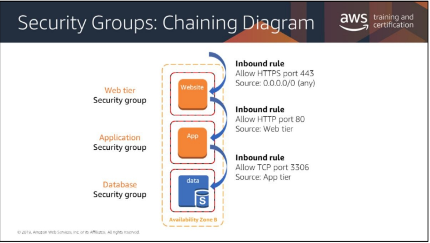

# Security in the Cloud

## Security Groups
* Virtual firewalls that control inbound & outbound traffic
* Traffic can be restricted by any IP or port or protocol
* Rules are stateful
* ###  By Default
    * Inbound traffic is blocked
    * SSH is opened in order to create the application

## Controlling Traffic
* Inbound rules are created for each functional tier

## NACL
* Stateless network control lists
* Bound to the subnet

## Best Practice
* Add a _WAF SANDWICH_ before your Website/App/Data servers
    * Load Balancer => WAF => Load Balancer => WAF
