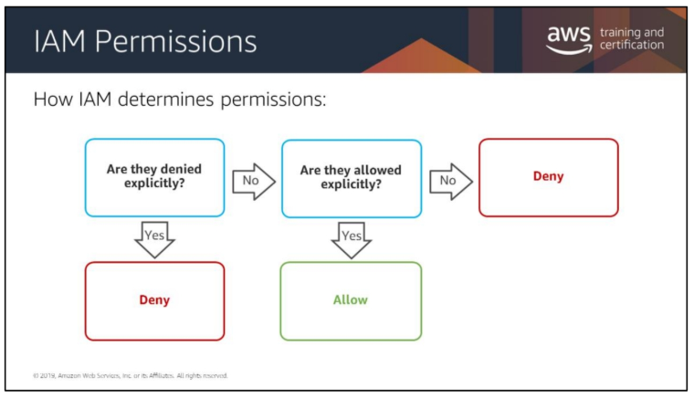

# Identity and Access Management

## Overview
* What is IAM
    * This is a free and necessary service
    * This is how we control Principal Entities
        * What are Principal Entities?
            * __Users__
            * __Groups__
            * __Roles__

## The AWS Account Root User
* Full Permissions
    * Billing Information
    * Delete the account
    * Entire architecture and its components
* The AWS account root user has extreme power and cannot be limited.

## A Safer Way to Administer
* Create IAM admin user
* Lock away the root user credentials
* Use IAM admin user
    *  If an IAM account principal needs more privileges, they can be added. 
    * If privileges need to be removed or revoked, it can be done with minimal impact on an environment

### __LEAST PRIVALEGE PRINCIPAL__
* Example:
    * Group has full access to S3 Bucket #1
    * Restricted user has only GET and LIST permissions to S3 Bucket #1
    * Restriced user gets placed in Group.
        * User still only has GET and LIST permissions.

## IAM Principals
* __IAM User__
    * IAM users are not seperate AWS accounts. They are users within your account.
    * Each user has their own credentials
    * IAM users are authorized to perform specific AWS actions based on their permissions.
    * When creating an IAM User:
        * There are no default permissions
    * When granting permissions:
        * A formal declaration of one or more permissions is given
        * Evaluated at the time of the request
        * IAM has no visibility above the hypervisor
            * In other words: IAM obviously doesnt manage the permissions in your web app. 
* __Federated User__
* __IAM Role__
    * A role lets you define a set of permissions to access the resources that a user or service needs.
    * Typically a temporary Guest Account
* __Identity Provider (IdP)__
    * For example:
        * Login with Amazon
        * Sign in with Facebook

## How does IAM determine Permissions
* Are they denied explicitly?
    * if YES --> DENY
    * if NO --> Are they allowed explicitly?
        * if NO --> DENY
        * if YES --> What action are they allowed? What resource?

## Granting Permissions
* _Resource-Based: Attached to an AWS resource_
    * AKA: Service Control Policies (SCPs)
    * Attached to:
        * AWS resources
    * Controls:
        * Actions allowed by specific principal
        * What conditions are required
        * Are always inline policies
        * No AWS-managed resource-based policies
* _Identity-Based: Attached to an IAM principal_
    * Identity Based Policies are:
        * Attached to:
            * Users
            * Groups
            * Roles
        * Types of Policies:
            * AWS-managed
                * Templated AWS Policy
            * Customer-managed
                * You editted an existing AWS Policy 
            * Inline
                * You created your own policy
        * Control:
            * Actions performed
            * Which resources
            * What conditions are required