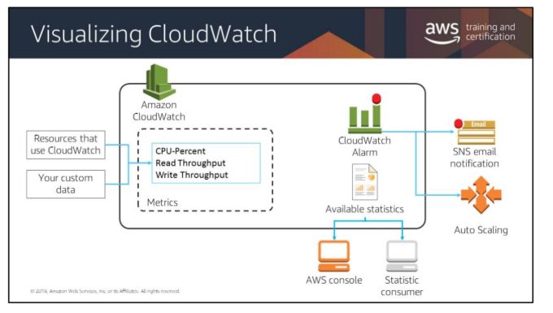

# Introduction to Elasticity, High Availability, and Monitoring

## Overview
* Understanding Elasticity
* Monitoring
    * Use __CloudWatch__ for 
        * EC2s:
            * Packets in/out
            * __CPU utilization__
        * EBS:
            * __Rejected connection requests__
                * Create more volumes
        * ELBs:    
            * __Overall latency__
* Scaling

## What is Elasticity
* An elastic infrastructure is able to intelligently provision and delete resources based on demand
    * Volume-based demand - dynaminc
    * Time-based demand - schedule

## What is Monitoring
* Operational Health
* Resource Utilization
* Application Performance
* Security Auditing

## CloudWatch
* Collects metrics __AND__ logs 
* *NOTE* 15 months by default
* *NOTE* CloudWatch does not inherently log Memory utilization
* Can trigger changes in capacity in a resource, based on rules you set

### Collecting Metrics Flow  
* AWS / EC2 Namespace
    * --> Metric
        * --> Data Point Polling
            * --> Monitor
                * --> Thresholds
                    * --> Alarm
                        * --> Notifications
                            * --> Target
                                * --> Event

## Scaling
* ELB
    * Subnets are defined
    * ELB Registration
    * Tied to the Auto Scaling group
* CloudWatch
    * Monitor and Alert
* Auto-Scaling
    * Launch Template
        * EC2 Instance
        * Security Group
        * User Data
    * Execute Scaling Policy
    * Registering / Deregistration
        * __Connection Draining__

## Providing Elasticity with Auto Scaling
* Launches or terminates instances based on specified conditions
* Automatically registers new instances with load balancers when specified
* Can launch across AZs
* ### Ways to Auto Scale
    * Scheduled
    * Dynamic
    * Predictive

